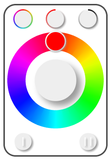

HueTouch
========

WARNING: WORK IN PROGRESS

Philips Hue HTML5 touch friendly widget.

This allows you to control:

- hue, saturation, brightness & on/off
- save and load 2 presets

for each of your Philips Hue lights.
This widget is inpired by the Philips To Be Touched DMX physical controller.
(Skip >0:50 to see functionality)
https://www.youtube.com/watch?v=RFSpjVLHz6s
